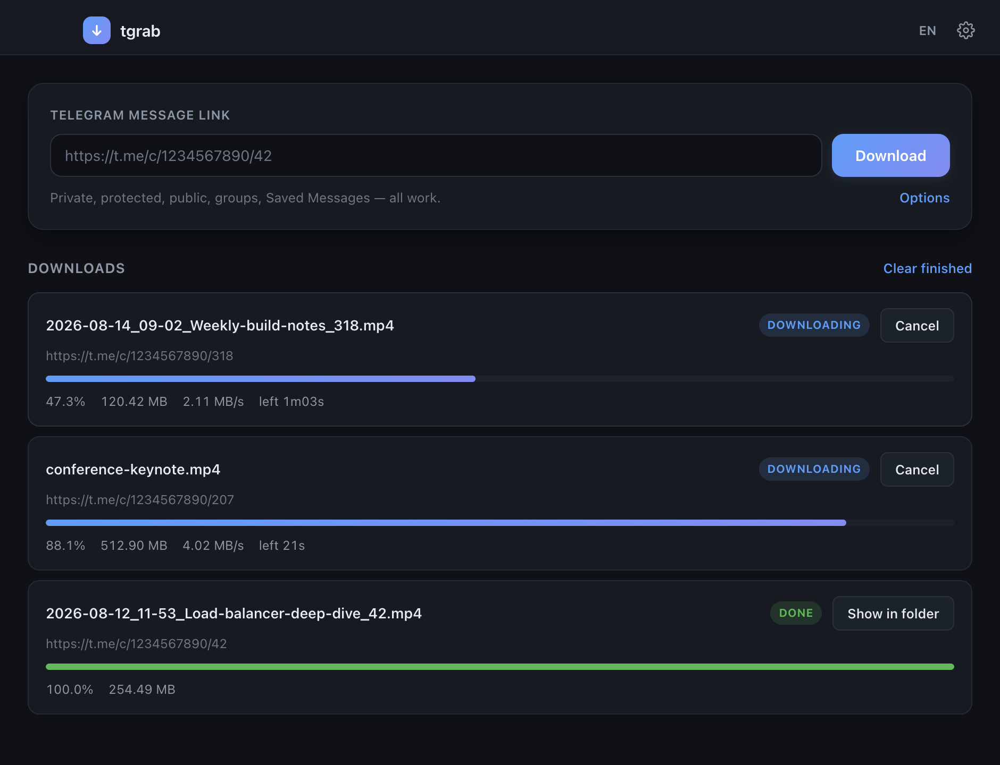
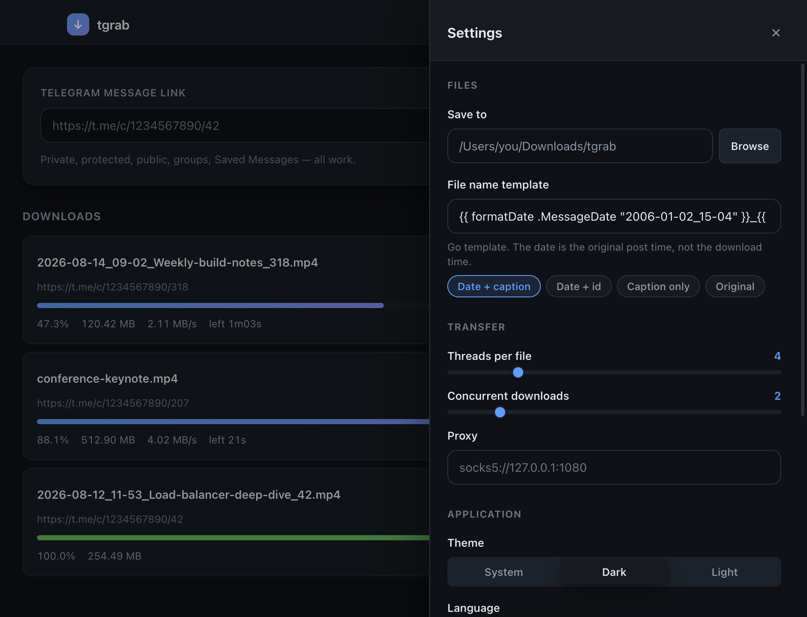
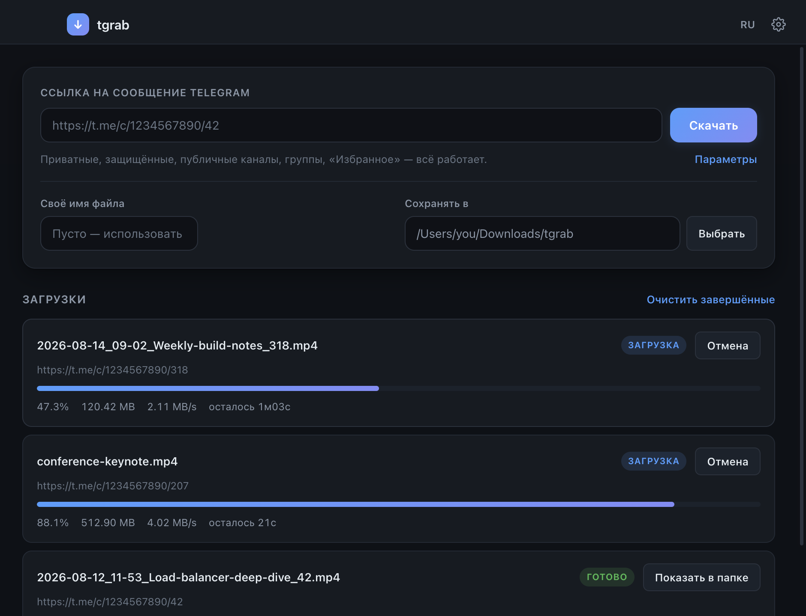
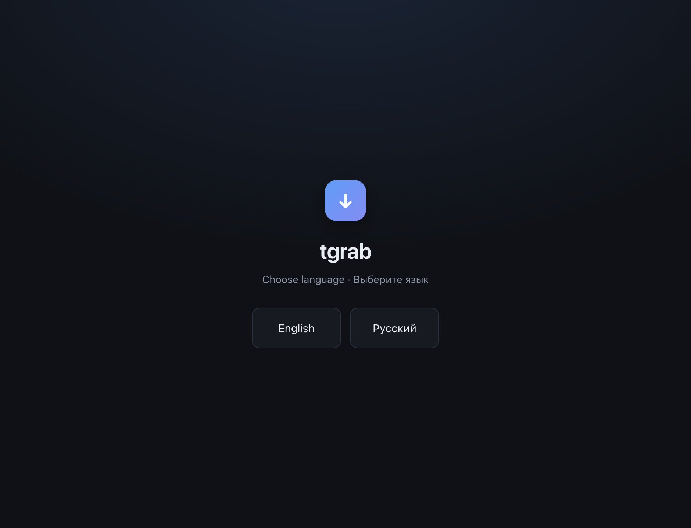

# tgrab

[English](README.md) · **Русский** · [AGENTS.md](AGENTS.md)

*(читается «ти-грэб» — `tg` + `grab`)*

Загрузчик медиа из Telegram, который оставляет после себя нормальный архив. Приложение, CLI и
скилл для ИИ-агентов — под всеми тремя один движок.



---

## Проблема

[tdl](https://github.com/iyear/tdl) — отличный загрузчик. Вот что он отдаёт:

```
1234567890_42_98765432109876.mp4
```

ID канала, ID сообщения и внутренний ID файла. Три числа, по которым не понять, что внутри.
Скачай полсотни — получишь кучу, в которой ничего не найти.

Его прогресс-бар из скрипта тоже не виден: вывод буферизуется, и ты две минуты смотришь в
молчащий терминал.

## Что делает tgrab

```
2026-08-12_11-53_Разбор-балансировщика_42.mp4
```

Дата и время публикации, подпись поста и ID сообщения — чтобы файл сопоставлялся со ссылкой
`t.me/c/<канал>/<msg_id>`.

- **Читаемые имена** из даты поста и подписи, а не числовые ID
- **Выгрузка канала целиком** одной командой
- **Видимый прогресс** — живой список в приложении, статус-строка в терминале
- **Любой чат Telegram** — приватный, защищённый, публичный, группы, «Избранное»
- **Русский и английский**, выбор при первом запуске
- **Дружелюбен к агентам** — `--json` везде, задокументированные коды возврата

## Три способа использования

| | Для чего | Начать |
|---|---|---|
| **GUI** | Мышкой, со списком загрузок | [Releases](https://github.com/kr1ke/tgrab/releases) |
| **CLI** | Терминал, скрипты, серверы | [`bin/tgrab`](bin/tgrab) |
| **Скилл** | Claude Code и другие ИИ-агенты | [`skill/tgrab/`](skill/tgrab/) |

## Структура репозитория

```
tgrab/
├── bin/
│   ├── tgrab              CLI — один bash-скрипт, без сборки
│   └── progress.sh        отрисовка статус-строки (текст и --json)
├── gui/                   Electron-приложение
│   ├── main.js            процесс, установка tdl, движок загрузок
│   ├── preload.js         узкий мост contextBridge
│   └── renderer/          интерфейс — index.html, styles.css, app.js
├── skill/tgrab/
│   └── SKILL.md           скилл: копировать в .claude/skills/
├── scripts/               генератор скриншотов для README
├── docs/screenshots/      картинки с этой страницы
├── .github/workflows/     кросс-платформенная сборка релизов
├── AGENTS.md              контракт для ИИ-агентов
└── README.md · README.ru.md
```

---

## Приложение

Скачать для своей платформы из [Releases](https://github.com/kr1ke/tgrab/releases) — macOS
`.dmg`, Windows `.exe`, Linux `.AppImage` или `.deb`.

Сборки **без подписи**. macOS предупредит при первом запуске: правый клик по приложению →
*Открыть* → *Открыть*. Windows SmartScreen: *Подробнее* → *Выполнить в любом случае*. Подпись
требует платных сертификатов.

Вставить ссылку, нажать «Скачать». Своё имя для конкретной загрузки — в «Параметрах», общий
шаблон для всех — в «Настройках».

<table>
<tr>
<td width="50%"></td>
<td width="50%"></td>
</tr>
<tr>
<td align="center"><em>Настройки — шаблон, потоки, прокси, тема</em></td>
<td align="center"><em>Русский интерфейс с раскрытыми параметрами</em></td>
</tr>
</table>

Запуск из исходников:

```bash
cd gui && npm install && npm start
```

## CLI

```bash
git clone https://github.com/kr1ke/tgrab
cd tgrab
./bin/tgrab doctor
```

Это вся установка — ни сборки, ни рантайма, ни пакетного менеджера. `tdl` скачивается сам при
первом использовании со сверкой контрольной суммы.

**Нужны:** macOS или Linux, `bash`, `curl`, `perl` (всё предустановлено), Telegram Desktop с
активным входом. `ffmpeg` опционально, для проверки скачанного.

```bash
./bin/tgrab login                                              # интерактивно, один раз
./bin/tgrab get "https://t.me/c/<channel_id>/<msg_id>" --dir ~/Videos
./bin/tgrab progress
./bin/tgrab clean                                              # удалить ключ
```

```
⏳ соединение с Telegram…
⬇  47.3% [███████████░░░░░░░░░░░░░] 120.42 MB · 2.11 MB/s · осталось 1м03с
✓ готово — 254.49 MB за 2м01с (2.10 MB/s)
```

| Команда | |
|---|---|
| `login [--passcode <код>]` | импорт сессии из Telegram Desktop (интерактивно) |
| `get <url> [dir]` | скачать медиа по ссылке на сообщение |
| `archive <chat> [--last N]` | пакетно забрать последние медиа (по умолчанию 50) |
| `progress` | текущая статус-строка |
| `chats` | список чатов с их id |
| `doctor` | состояние зависимостей и авторизации |
| `clean` | удалить сохранённый ключ |

Общие опции: `--lang <en\|ru>`, `--dir <path>`, `--json`, `--quiet`, `--help`, `--version`.

## Скилл

Для Claude Code и других агентов, читающих файлы `SKILL.md`:

```bash
mkdir -p ~/.claude/skills && cp -r skill/tgrab ~/.claude/skills/
```

Дальше достаточно ссылки на Telegram в диалоге. В скилле зашита процедура и грабли — прежде
всего то, что **скачанный файл нельзя искать по времени**.

Агентам, работающим с CLI напрямую, — [AGENTS.md](AGENTS.md): всегда `--json --lang en`, `get`
возвращается сразу, поэтому опрашивать `progress --json` раз в ~15 с, и никогда не пытаться
автоматизировать `login`.

## Язык

При первом запуске и приложение, и CLI спрашивают:

```
Choose language / Выберите язык:
  1) English
  2) Русский
```



Сохраняется в `~/.config/tgrab/config` (CLI) или в настройках приложения. Переопределяется через
`--lang ru` или `TGRAB_LANG`. Без сохранённого выбора берётся из `$LANG`. При `--json` вопрос
не задаётся.

## Шаблон имени файла

```
{{ formatDate .MessageDate "2006-01-02_15-04" }}_{{ if .FileCaption }}{{ filenamify .FileCaption 60 }}_{{ end }}{{ .MessageID }}
```

Дата — время **публикации**, а не скачивания: так архив сортируется по смыслу, а повторное
скачивание даёт то же имя. Подпись поста — единственное человекочитаемое поле, которое отдаёт
Telegram: `.FileName` там обычно безликое число, а читаемого названия канала не существует
вовсе, только числовой `DialogID`.

Пресеты в приложении: дата + подпись, дата + id, только подпись, как в Telegram. В CLI —
переменная `$TG_TEMPLATE`.

## Грабли

Каждая стоила реального времени.

| Симптом | Причина |
|---|---|
| Файл «пропал», хотя загрузка сказала «готово» | mtime — это **дата поста**, а не скачивания: `find -newermt` и `ls -lat` его не увидят. Искать по имени. |
| Размер ровно 1 МиБ или 128 МиБ | обрыв на границе буфера: файл битый, а не маленький |
| `tgrab login` выходит с кодом 5 | вход интерактивный, нужен настоящий терминал |
| `brew install iyear/tap/tdl` падает | тап удалён из upstream; tgrab берёт релиз напрямую |
| `timeout: command not found` | на macOS нет утилиты `timeout` |

## Безопасность

Импорт сессии копирует **ключ авторизации** Telegram в `~/.tdl` открытым текстом. Любой процесс
с доступом к домашней папке — вредонос, синхронизируемый в облако бэкап — получает полный доступ
к аккаунту, и **2FA не спасает**: извлечённый ключ уже «за» ней. Вызывайте `tgrab clean` или
включите в приложении «удалять ключ при выходе».

Сверка контрольной суммы tdl доказывает лишь отсутствие подмены при передаче. Она не
подтверждает добросовестность издателя, и аудита бинарника никто не делал.

Telegram ограничивал и банил аккаунты за агрессивное использование стороннего API. Несколько
файлов — ничто, флажок поднимается на массовой выкачке.

Ради одного файла проще открыть пост в Telegram Desktop и сохранить через правый клик →
*Save As*: нулевой дополнительный риск. tgrab нужен там, где это перестаёт масштабироваться.

## Статус

**Ранний прототип.** CLI — bash-скрипт, GUI — Electron, оба поверх `tdl`. Интерфейсы считать
нестабильными.

## О лицензии

`tdl` распространяется под **AGPL-3.0**. tgrab скачивает и вызывает его как отдельный
исполняемый файл — это mere aggregation, производной работы не возникает. Встраивание или
линковка натянули бы AGPL на всё, что ты распространяешь, а её сетевая оговорка ударила бы по
хостируемым сервисам. Именно поэтому tdl подтягивается в рантайме, а не лежит в репозитории.
Это не юридическая консультация — проверить стоит до того, как архитектура застынет.

Файла лицензии пока нет, а это по умолчанию «все права защищены» — для публичного репозитория
обычно не то, что нужно.
