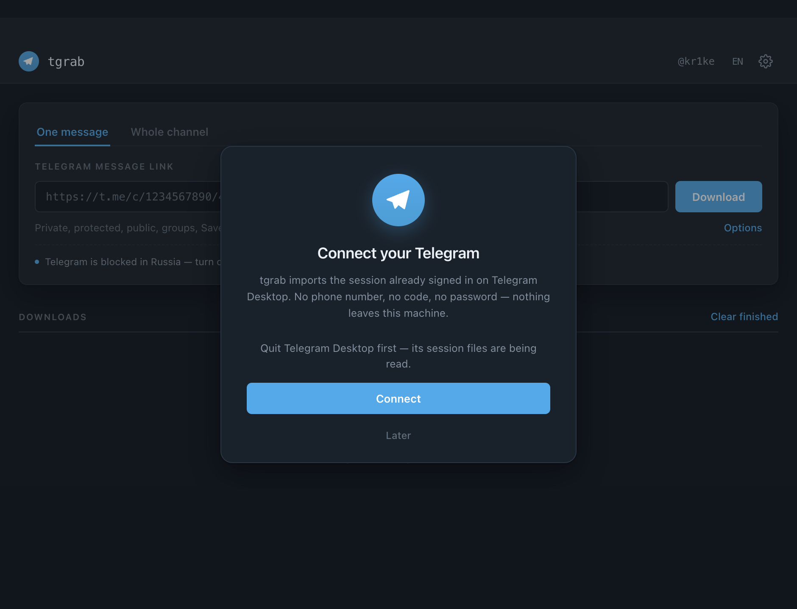
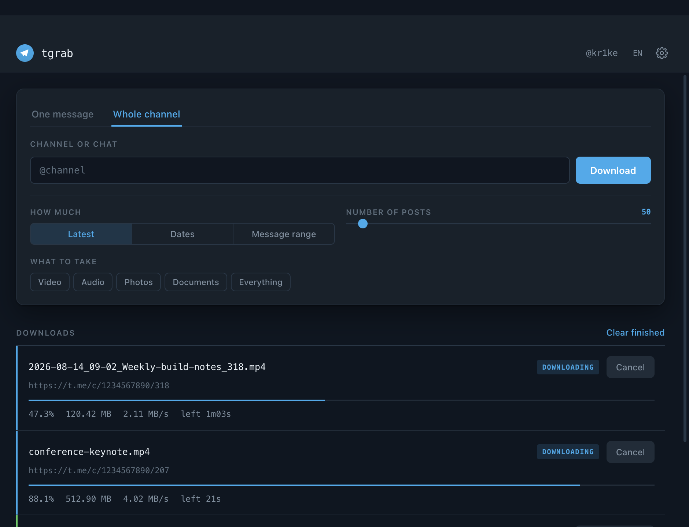
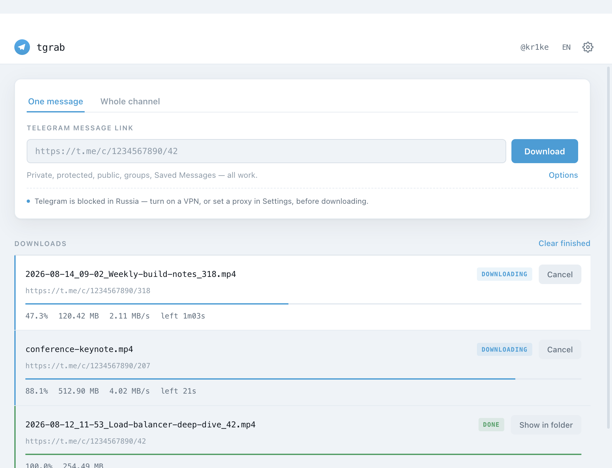

# tgrab

[English](README.md) · **Русский** · [AGENTS.md](AGENTS.md)

Загрузчик медиа из Telegram, который оставляет после себя нормальный архив. **Качает из
приватных каналов, защищённых каналов с запретом сохранения, групп и личных чатов** — из всего,
что и так видит твой аккаунт. Приложение, CLI и скилл для агентов — под всеми тремя один движок.


## Зачем

[tdl](https://github.com/iyear/tdl) — отличный загрузчик. Отдаёт он вот это:
`1234567890_42_98765432109876.mp4` — ID канала, ID сообщения, внутренний ID файла. Полсотни
таких — и это куча, в которой ничего не найти. Прогресс-бар из скрипта тоже не виден.

tgrab даёт `2026-08-12_11-53_Разбор-балансировщика_42.mp4` и статус-строку, за которой можно
следить.

## Возможности

> ### 🔒 Качает из приватных и защищённых каналов
> Ради этого всё и затевалось. Закрытые каналы, где ты состоишь, каналы с отключённым
> сохранением, ограниченные группы — tgrab достаёт медиа отовсюду, потому что заходит **под
> тобой**: твоей же сессией Telegram, импортированной из Telegram Desktop. Без бота, без прав
> администратора, без публичной ссылки. Видишь в своём Telegram — значит, можешь заархивировать.

**Источники** — приватные каналы · защищённые каналы с запретом сохранения · публичные каналы ·
группы и супергруппы · темы форумов · личные переписки · «Избранное»

**Одно сообщение или канал целиком**
- Ссылка забирает конкретный пост — главный сценарий, на нём приложение и открывается
- Канал забирается **последними N постами, диапазоном дат или диапазоном номеров**
- Фильтр по типу: видео · аудио · фото · документы · всё
- Своё имя для конкретного файла или шаблон для всех
- Докачка прерванного, пропуск уже скачанного
- Многопоточность, управление параллельностью и прокси
- Альбом забирается целиком, даже если ссылка на один элемент

**Именование** — файлы ложатся как `дата_время_подпись_id` по исходному посту: архив
сортируется по смыслу, повторное скачивание не плодит дубликаты.

**После загрузки** — всегда в новый файл, оригинал не трогается:
- **Только звук** — выкинуть видео, оставить `.m4a`
- **Сжать** — на выбор 1080p · 720p · 480p · 360p
- **Формат** — MP4 · MKV · WebM · MP3 · M4A, без перекодирования там, где контейнер позволяет
- **Ускорить** — 1.25× · 1.5× · 2×, звук без «бурундука»
- **Обрезать** — тянуть полосу или вписать время, одно синхронно с другим; режет ровно там, где попросили

**Интерфейс** — русский и английский, светлая и тёмная тема, живой прогресс со скоростью и
оценкой времени, `--json` у каждой команды CLI для агентов.

> **В России Telegram заблокирован.** Перед скачиванием включите VPN или пропишите прокси в
> настройках / передайте `--proxy`.

## Установка

> **Только для десктопа.** tgrab работает на macOS, Windows и Linux. Мобильного приложения нет
> и в таком же виде быть не может: iOS вообще запрещает приложениям запускать подпроцессы,
> поэтому бинарнику `tdl` там нечем исполняться, а на телефоне нет сессии Telegram Desktop —
> именно её импорт и позволяет входить без кода и пароля.


| | Для чего | |
|---|---|---|
| **Приложение** | мышкой | [**Скачать последний релиз**](https://github.com/kr1ke/tgrab/releases/latest) — macOS `.dmg` · Windows `.exe` · Linux `.AppImage` / `.deb` |
| **CLI** | терминал, скрипты | `git clone https://github.com/kr1ke/tgrab && cd tgrab && ./bin/tgrab doctor` |
| **Скилл** | Claude Code, агенты | `cp -r skill/tgrab ~/.claude/skills/` |

`tdl` скачивается сам при первом запуске со сверкой контрольной суммы. Больше ставить нечего.

> Сборки **без подписи**. macOS: правый клик → *Открыть* → *Открыть*. Windows SmartScreen:
> *Подробнее* → *Выполнить в любом случае*. Подпись требует платных сертификатов.

## Использование

```bash
./bin/tgrab login                                    # интерактивно, один раз
./bin/tgrab get "https://t.me/c/<канал>/<msg_id>" --dir ~/Videos
./bin/tgrab progress
./bin/tgrab clean                                    # удалить ключ
```

```
⬇  47.3% [███████████░░░░░░░░░░░░░] 120.42 MB · 2.11 MB/s · осталось 1м03с
```

`login` · `get` · `archive <chat> --last N` · `progress` · `chats` · `doctor` · `clean`.
Опции: `--lang <en|ru>` `--dir <path>` `--json` `--quiet` `--help`.

<table>
<tr>
<td width="50%"></td>
<td width="50%"></td>
</tr>
<tr>
<td align="center"><em>Вход — без кода и пароля</em></td>
<td align="center"><em>Канал целиком: по количеству, датам или номерам</em></td>
</tr>
<tr>
<td width="50%"></td>
<td width="50%"></td>
</tr>
<tr>
<td align="center"><em>Шаблон, потоки, прокси, тема</em></td>
<td align="center"><em>Светлая тема</em></td>
</tr>
</table>


## Безопасность

Импорт сессии копирует **ключ авторизации** Telegram в `~/.tdl` открытым текстом. Любой процесс
с доступом к домашней папке получает полный доступ к аккаунту, и **2FA не спасает** —
извлечённый ключ уже «за» ней. Вызывайте `tgrab clean` или включите «удалять при выходе» в
приложении.

Сверка контрольной суммы доказывает лишь отсутствие подмены при передаче. Она не подтверждает
добросовестность издателя, и аудита бинарника никто не делал.

<details>
<summary><b>Структура репозитория</b></summary>

```
bin/tgrab              CLI — один bash-скрипт, без сборки
bin/progress.sh        отрисовка статус-строки (текст и --json)
gui/                   Electron — main.js, preload.js, renderer/
skill/tgrab/SKILL.md   скилл для агентов
scripts/               генераторы скриншотов и иконки
.github/workflows/     сборка релизов под macOS / Windows / Linux
AGENTS.md              контракт для ИИ-агентов
```
</details>

<details>
<summary><b>Шаблон имени файла</b></summary>

```
{{ formatDate .MessageDate "2006-01-02_15-04" }}_{{ if .FileCaption }}{{ filenamify .FileCaption 60 }}_{{ end }}{{ .MessageID }}
```

Дата — время **публикации**, поэтому архив сортируется по смыслу, а повторное скачивание даёт
то же имя. Подпись поста — единственное человекочитаемое поле, которое отдаёт Telegram:
`.FileName` там обычно безликое число, а читаемого названия канала в шаблоне не существует
вовсе, только числовой `DialogID`.

Пресеты в приложении, `$TG_TEMPLATE` в CLI.
</details>

<details>
<summary><b>Пакетная выгрузка и прочие грабли</b></summary>

```bash
./bin/tgrab archive @channel --last 100 --dir ~/Videos
```

Под капотом: `tdl chat export`, затем `tdl dl -f`. Для тонкой настройки — напрямую через tdl:
`-T` определяет, как читается `--input` (`time` — диапазон таймстемпов, `id` — диапазон номеров
сообщений, `last` — количество), `-f` фильтрует, например
`"Media.Size > 100*1024*1024"`. Список полей зависит от версии:
`tdl chat export -c <chat> -f -`.

| Симптом | Причина |
|---|---|
| Размер ровно 1 МиБ или 128 МиБ | обрыв на границе буфера — файл битый, а не маленький |
| `tgrab login` выходит с кодом 5 | вход интерактивный, нужен настоящий терминал |
| `brew install iyear/tap/tdl` падает | тап удалён из upstream; tgrab берёт релиз напрямую |
| `timeout: command not found` | на macOS нет утилиты `timeout` |

Telegram ограничивал аккаунты за агрессивное использование стороннего API. Несколько файлов —
ничто, флажок поднимается на массовой выкачке.
</details>

## Статус и лицензия

**Ранний прототип** — CLI на bash, GUI на Electron, оба поверх `tdl`. Интерфейсы нестабильны.

`tdl` под **AGPL-3.0**. tgrab скачивает и запускает его как отдельный исполняемый файл — mere
aggregation, поэтому AGPL до этого кода не дотягивается. Встраивание натянуло бы AGPL на всё,
что вы распространяете. Это не юридическая консультация.

Файла лицензии пока нет — по умолчанию «все права защищены».
